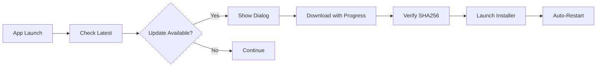

# 🚁 THE FPV NEXUS™ by ECHO CORP

> **The Ultimate FPV Command Center** — Where pilots unite technology, precision, and the endless sky.

<div align="center">


**[📥 Download Latest](https://github.com/mrelive/ECHOCORPNEXUS/releases/latest) • [🚀 Quick Start](#-quick-start) • [📚 Documentation](#-features) • [🛠️ Development](#-development)**

</div>

---

## 🌟 **WELCOME TO THE FUTURE OF FPV**

**THE FPV NEXUS™** isn't just another tool—it's your **digital cockpit** for the drone revolution. Born from the minds at **ECHO CORP**, this powerhouse application transforms how pilots manage, tune, and master their FPV quads.

### ⚡ **One App. Infinite Possibilities.**

```
🎯 Precision Tuning Tools     🗺️ Global Fly Spot Atlas     📊 Advanced Analytics
🔧 Integrated Betaflight      🎪 Trick Library & Tutorials  ☁️ Cloud Sync & Backup
```

---

## 🚀 **Quick Start**

### **For Pilots** 
1. **[Download the installer](https://github.com/mrelive/ECHOCORPNEXUS/releases/latest)** 
2. **Run setup** → One-click installation
3. **Launch THE NEXUS** → Your FPV command center awaits
4. **Stay updated** → Auto-update notifications keep you current

### **System Requirements**
- 🖥️ **Windows 10/11** (x64)
- 💾 **666MB** free space
- 🌐 **Internet** for updates & cloud features

---

## 🎯 **Features That Define Excellence**

<table>
<tr>
<td width="50%">

### 🛠️ **PRECISION TOOLS**
- **Quick Tuning Arsenal** — Professional-grade helpers
- **Plug-N-Dump™** — Lightning-fast BBL workflow  
- **PID Health Scanner** — Deep diagnostic insights
- **Blackbox Comparator™** — Side-by-side log analysis
- **Motor Doctor** — Health monitoring & optimization

</td>
<td width="50%">

### 🗺️ **EXPLORE & LEARN**
- **THE NEXUS SKY ATLAS™** — Global fly spot database
- **THE FPV TRICK NEXUS™** — Master every maneuver
- **THE FPV TUNING GURU™** — AI-powered guidance
- **Integrated Betaflight** — No switching apps

</td>
</tr>
</table>

---

## 🏗️ **Built on Innovation**

### **🎨 Frontend Excellence**
```typescript
⚛️ React 18          // Lightning-fast UI
🎨 Tailwind CSS      // Beautiful, responsive design  
⚡ Vite Subapps      // Modular architecture
🖼️ Electron Shell    // Native desktop experience
```

### **🔥 Backend Power**
```javascript
🚀 Express.js        // High-performance API
📦 Supabase Cloud    // Scalable storage
🔄 Real-time Sync    // Live data updates
🛡️ Enterprise Security // Your data, protected
```

### **📦 Professional Packaging**
```bash
🏗️ Electron Builder  // Native Windows installer
🔄 Auto-Updates      // Seamless version management
📊 Progress Tracking // Real-time download status
🔐 SHA256 Verification // Security first
```

---

## 🎪 **Experience The Modules**

<div align="center">

| Module | Purpose | Technology |
|:------:|:-------:|:----------:|
| 🎯 **Quick Tuning Tools™** | Accelerate your tuning workflow | React + Custom Algorithms |
| 🗺️ **Sky Atlas™** | Discover epic flying locations | Vite SPA + Maps Integration |
| 🎪 **Trick Nexus™** | Master FPV maneuvers | Interactive Learning Platform |
| 🤖 **Tuning Guru™** | AI-powered tuning assistance | Machine Learning + Analytics |
| ⚙️ **Betaflight Hub** | Embedded configurator | Web Assembly + Native APIs |

</div>

---


## 🌐 **Auto-Update Magic**

THE NEXUS features **enterprise-grade auto-updates**:



- 📡 **Smart Detection** — Checks GitHub releases
- 📊 **Progress Tracking** — Real-time download status  
- 🔐 **Security First** — SHA256 verification
- 🎯 **One-Click Install** — Seamless experience

---

## 🎨 **Screenshots**

<div align="center">

### 🎯 **Main Dashboard**
*Your FPV command center — clean, powerful, intuitive*

### 🗺️ **Sky Atlas Integration** 
*Discover new horizons with our embedded fly spot database*

### 📊 **Advanced Analytics**
*Deep insights into your flight data and tuning performance*

### 🎪 **Trick Library**
*Master every maneuver with our comprehensive learning platform*

</div>

---

## 🏆 **Why Choose THE NEXUS?**

<table>
<tr>
<td width="33%" align="center">

### 🚀 **Performance**
**Lightning-fast** processing  
**Real-time** analytics  
**Optimized** algorithms  

</td>
<td width="33%" align="center">

### 🎨 **Experience**
**Intuitive** interface  
**Professional** design  
**Seamless** workflow  

</td>
<td width="33%" align="center">

### 🛡️ **Reliability**
**Enterprise** security  
**Auto-updates** included  
**24/7** availability  

</td>
</tr>
</table>

---

## 🔧 **Configuration**

### **Environment Variables**
```bash
# GitHub Integration
GITHUB_TOKEN=your_token_here
RELEASE_GITHUB_REPO=mrelive/ECHOCORPNEXUS

# Supabase Cloud
SUPABASE_URL=your_project_url
SUPABASE_SERVICE_KEY=your_service_key

# Optional Overrides
RELEASE_DOWNLOAD_URL=custom_url
```

---


---

## 🤝 **Contributing**

We welcome contributions from the FPV community!

```bash
# Fork, clone, branch
git checkout -b feature/amazing-improvement

# Make your magic happen
# ... code, test, document ...

# Submit your contribution
git push origin feature/amazing-improvement
# Create a Pull Request
```

**Guidelines:**
- 🎯 Keep changes focused and modular
- ✅ Test thoroughly before submitting  
- 📝 Document new features clearly
- 🎨 Follow existing code style

---

## 🛡️ **Security & Privacy**

- 🔒 **Local-first** — Your data stays on your machine
- 🛡️ **Encrypted** communication with cloud services
- 🚫 **Zero telemetry** — We don't track you
- 🔐 **SHA256** verification for all downloads

---


---

## 📄 **License**

**Proprietary Software** © 2025 **ECHO CORP**. All rights reserved.

---

<div align="center">

### 🚁 **Ready to Transform Your FPV Experience?**

**[📥 Download THE FPV NEXUS™ By ECHO CORP](https://github.com/mrelive/ECHOCORPNEXUS/releases/latest)**

---

*Built with ❤️ by **ECHO CORP** for the global FPV community*

**FIND YOUR FUTURE IN THE SKIES™**

</div>CHOCORPNEXUS

This repository contains The FPV NEXUS - By ECHO CORP. If you’re looking for previous experimental Betaflight integration notes, those have been removed as part of a cleanup.
