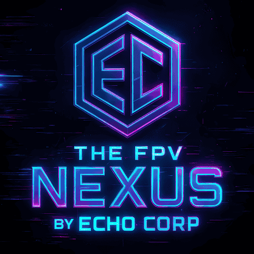

# The FPV Nexus™ By Echo Corp™

### [Download the latest release](https://github.com/mrelive/ECHOCORPNEXUS/releases/latest)

A professional FPV tuning and analysis platform built for pilots who want cleaner logs, faster workflows, and better performance in the field.

---

## Overview

The FPV Nexus™ By Echo Corp™ is a desktop-first FPV ecosystem that brings together Blackbox workflow automation, deep-flight analytics, configurator access, and cloud-connected tune collaboration in one product.

This platform was refined through a full year in beta with over 150 active beta testers, and it was built with direct input from the FPV community at every stage of development.

---

## Key Highlights

- End-to-end tuning workflow from log extraction to actionable tuning decisions
- Community-informed product direction shaped by real pilot feedback
- Desktop reliability for local tooling with cloud connectivity where it matters
- Professional UX for both experienced tuners and pilots leveling up

---

## Core Capabilities

### Plug-N-Dump Workflow

Automated log extraction flow designed to remove friction from Blackbox capture and file handling.

### Advanced Blackbox Analysis

High-signal tooling for diagnosing oscillations, filtering behavior, PID response, and stick interaction.

### Integrated Configuration Tools

Access key FC and ESC configuration workflows without fragmenting your setup process.

### Nexus Sky Atlas

Cloud-connected tune ecosystem for discovering, sharing, and learning from proven community setups.

---

## Community Validation

The FPV Nexus™ spent one full year in beta with over 150 beta testers across different skill levels, quad classes, and environments.

Product decisions, feature priorities, and quality-of-life improvements were guided by direct community feedback, making this a platform built with pilots, not just for pilots.

---

## Download

- Platform: Windows
- Installer size: approximately 200 MB
- Distribution: official installer releases from ECHO CORP™

---

### Release Channels

- Official: production release channel for all users
- Dev/Beta: limited channel for approved beta testers

---

## Distribution Notice

This page is intended as the official application download and release information page.

Source code is not distributed as part of this public download experience.

---

## Brand Statement

The FPV Nexus™ By Echo Corp™ is the result of community partnership, rigorous iteration, and a mission to raise the standard for FPV tuning software.

[Download the latest release](https://github.com/mrelive/ECHOCORPNEXUS/releases/latest)
